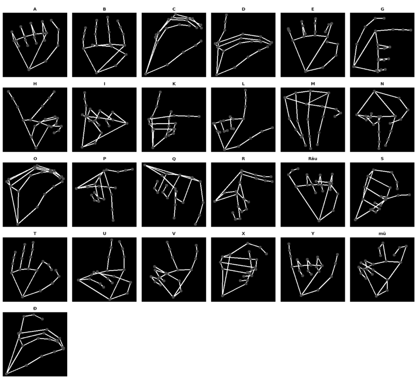

# VSL - Vietnamese Sign Language Recognition

Hệ thống nhận dạng ngôn ngữ ký hiệu tiếng Việt (VSL) theo thời gian thực sử dụng Deep Learning và Computer Vision.

---

## Tổng quan dự án

Hệ thống nhận diện **25 ký hiệu bảng chữ cái ngôn ngữ ký hiệu tiếng Việt** từ camera theo thời gian thực. Pipeline xử lý gồm:

1. Phát hiện bàn tay bằng **MediaPipe HandLandmarker** (21 keypoint)
2. Trích xuất ảnh skeleton bàn tay (224×224, nền đen)
3. Phân loại ký hiệu bằng mô hình Deep Learning (**MobileNetV2** hoặc **Custom CNN**)

**Tập dữ liệu:** [VSL v2 trên Kaggle](https://www.kaggle.com/datasets/cuongnk9104/vsl-v2) — 58,439 ảnh skeleton, 25 lớp, cân bằng tốt.



---

## Cài đặt

### Yêu cầu hệ thống

- Python 3.8+
- Webcam (để chạy demo)
- GPU khuyến nghị cho training (CPU vẫn chạy được)

### 1. Clone hoặc tải project

```bash
git clone https://github.com/TuanKiet1774/SignLanguage_Vietnamese.git
```

### 2. Cài đặt các dependencies

```bash
pip install opencv-python mediapipe torch torchvision pillow
```

### 3. Tải hand landmark model (tự động)

Lần chạy đầu tiên, model `hand_landmarker.task` sẽ được tải tự động từ:

```
https://storage.googleapis.com/mediapipe-models/hand_landmarker/hand_landmarker/float16/1/hand_landmarker.task
```

### File model

Đặt các file sau vào thư mục gốc của dự án:

| File                         | Mô tả                                          |
| ---------------------------- | ---------------------------------------------- |
| `mobilenetv2_checkpoint.pth` | Trọng số MobileNetV2                           |
| `customcnn_checkpoint.pth`   | Trọng số Custom CNN                            |
| `hand_landmarker.task`       | Model MediaPipe (tự động tải khi chạy lần đầu) |

---

## Sử dụng

### 1. Chạy Demo (Nhận dạng theo thời gian thực)

```bash
# Dùng MobileNetV2 (mặc định)
python demo_vsl.py

# Chỉ định model cụ thể
python demo_vsl.py --checkpoint mobilenetv2_checkpoint.pth
python demo_vsl.py --checkpoint customcnn_checkpoint.pth
```

**Phím tắt trong demo:**

| Phím        | Chức năng                                       |
| ----------- | ----------------------------------------------- |
| `Q` / `ESC` | Thoát                                           |
| `SPACE`     | Tạm dừng / Tiếp tục                             |
| `S`         | Chụp màn hình (lưu vào `saves/`)                |
| `C`         | Xóa lịch sử dự đoán                             |
| `D`         | Bật/tắt debug (hiển thị skeleton đầu vào model) |

### 2. Thu thập dữ liệu thực tế

```bash
# Thu thập tất cả 25 ký hiệu (5 giây/ký hiệu, 150 frame/ký hiệu)
python collect_data.py

```

**Phím tắt khi thu thập:**

| Phím    | Chức năng                             |
| ------- | ------------------------------------- |
| `SPACE` | Bắt đầu quay                          |
| `N`     | Bỏ qua, chuyển sang ký hiệu tiếp theo |
| `P`     | Quay lại ký hiệu trước                |
| `R`     | Ghi đè lại ký hiệu hiện tại           |
| `Q`     | Thoát                                 |

Dữ liệu thu thập lưu tại: `data/<TEN_KY_HIEU>/frame_XXXX.jpg`

### 3. Đánh giá mô hình trên dữ liệu thực tế

```bash
# Đánh giá cả hai mô hình trên dữ liệu đã thu thập
python evaluate_models.py

```

Kết quả lưu tại thư mục `report/`:

- `summary.csv` — So sánh tổng quan hai mô hình
- `per_class_detail.csv` — Độ chính xác từng ký hiệu
- `raw_predictions.csv` — Log dự đoán chi tiết
- `confusion_customcnn.png` / `confusion_mobilenetv2.png` — Ma trận nhầm lẫn
- `per_class_accuracy.png` — Biểu đồ độ chính xác theo lớp
- `confidence_distribution.png` — Phân bố độ tin cậy

### 4. Huấn luyện mô hình (Notebook)

Xem notebook tại `Notebook_Kaggle/`:

- `eda-vslv2.ipynb` — Phân tích khám phá dữ liệu (EDA)
- `train-vslv2.ipynb` — Pipeline huấn luyện đầy đủ (2 giai đoạn: frozen backbone → fine-tuning)

---

## Cấu trúc thư mục

```
demo/
├── data/                          # Dữ liệu thu thập (25 thư mục ký hiệu)
│   ├── A/ B/ C/ ... Y/
│   ├── Dd/                        # Ký hiệu Đ
│   ├── Rau/                       # Ký hiệu Râu
│   └── mu_/                       # Ký hiệu mũ
├── Notebook_Kaggle/
│   ├── eda-vslv2.ipynb            # Phân tích EDA
│   └── train-vslv2.ipynb          # Huấn luyện mô hình
├── report/                        # Kết quả đánh giá (CSV + PNG)
├── demo_vsl.py                    # Ứng dụng demo thời gian thực
├── collect_data.py                # Công cụ thu thập dữ liệu
├── evaluate_models.py             # Script đánh giá mô hình
├── label_map.json                 # Ánh xạ nhãn → chỉ số
├── hand_landmarker.task           # Model MediaPipe hand detection
├── mobilenetv2_checkpoint.pth     # Trọng số MobileNetV2
└── customcnn_checkpoint.pth       # Trọng số Custom CNN
```

---

## Chi tiết kỹ thuật

### Custom CNN Architecture

- 4 khối Convolution (BatchNorm + ReLU + MaxPool)
- 2 lớp Fully Connected
- Dropout để tránh overfitting
- Input: 224×224 ảnh grayscale

### MobileNetV2

- Pretrained trên ImageNet
- Fine-tuned 2 giai đoạn:
  1. Freeze backbone, huấn luyện classifier head
  2. Unfreeze toàn bộ, fine-tune với learning rate thấp hơn
- Input: 224×224 ảnh grayscale (3 channel giả)

### Augmentation (training)

- Random Rotation (±15°)
- Horizontal Flip
- Random Affine (dịch, scale)
- Normalization: mean=0.055, std=0.21

### Temporal Smoothing (demo)

- Buffer 8 frame để ổn định dự đoán
- Lấy nhãn xuất hiện nhiều nhất trong buffer
